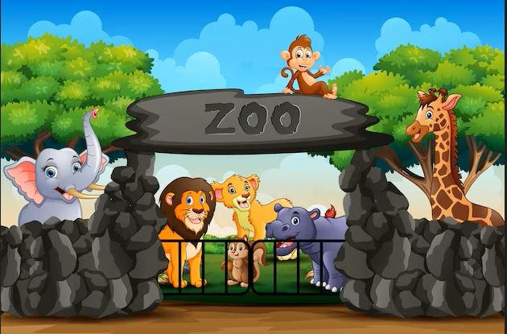

# Proyecto-Grafica
Contenido del proyecto final de computacion grafica

<h1>Proyecto Final para la materia de computación gráfica. </h1> 
<h2>Zoológico virtual </h2>  
<h2>Equipo 7:</h2>  

▶️ Moreno Duran Jaime       

<h3> Semestre 2023-2 | Grupo: 3</h3>

    </img>

